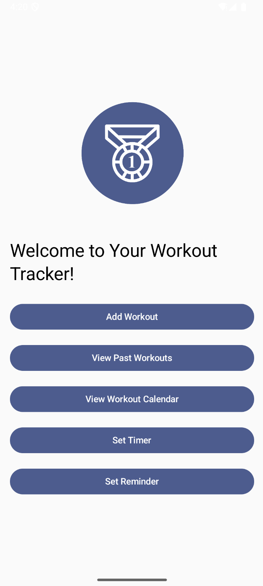
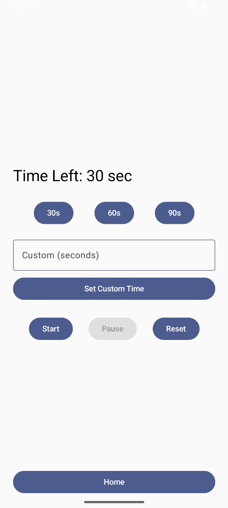
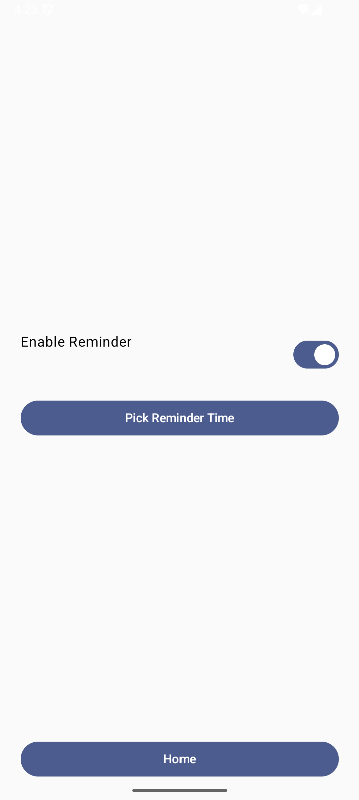

## Workout Tracker
A simple Android app to log workouts, track progress, and stay consistent with fitness goals, built by Kennedy Marren and Carmen Colilla Gomez. Built with Kotlin and modern Android components, it combines workout logging, calendar tracking, reminders, and timers into one app.

---

📸 Screenshots

    
 
    

---

### Features

- Add Workouts → Log details like date, activity, mood, music, weights, and machines used.

- Workout Calendar → Visualize past workouts by month, and see how many times you've worked out this month and last month.

- Progress Tracking → Export logs as CSV for analysis.

- Timer → Set custom timers for exercises or rest periods.

- Reminders → Get notified at your preferred time to stay consistent.

- Manage Workouts → View history and delete entries if needed.
