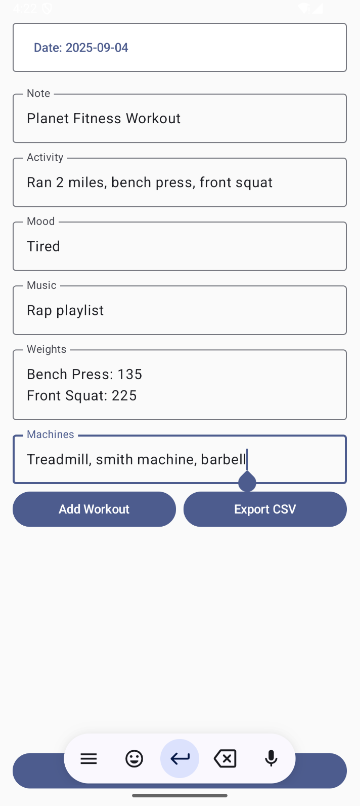
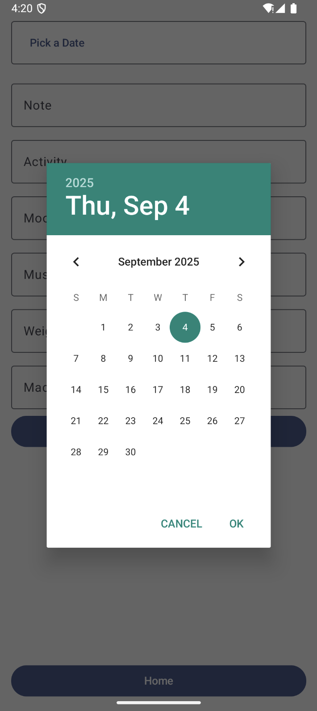
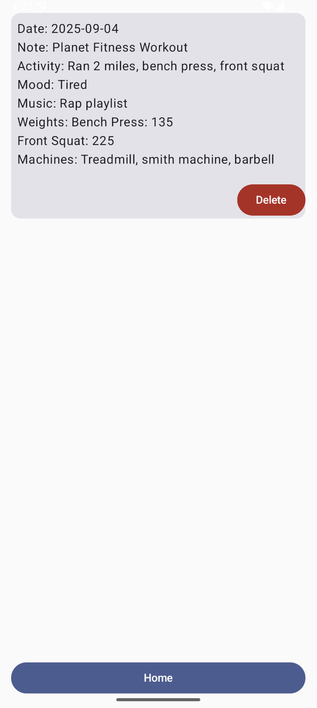
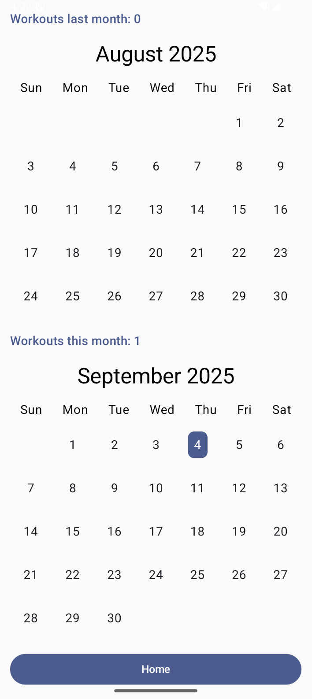
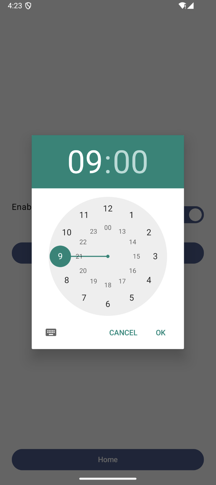

## Workout Tracker
A simple Android app to log workouts, track progress, and stay consistent with fitness goals, built by Kennedy Marren and Carmen Colilla Gomez. Built with Kotlin and modern Android components, it combines workout logging, calendar tracking, reminders, and timers into one app.

---

### Screenshots

  &nbsp;&nbsp;&nbsp;  &nbsp;&nbsp;&nbsp;  
 

  &nbsp;&nbsp;&nbsp;  &nbsp;&nbsp;&nbsp;  

  &nbsp;&nbsp;&nbsp;   

---

### Features

- Add Workouts → Log details like date, activity, mood, music, weights, and machines used.
  
- Manage Workouts → View history and delete entries if needed.

- Workout Calendar → Visualize past workouts by month, and see how many times you've worked out this month and last month.

- Progress Tracking → Export logs as CSV for analysis.

- Timer → Set custom timers for exercises or rest periods.

- Reminders → Get notified at your preferred time to stay consistent.

---

### Tech Stack

Language: Kotlin

UI: Android XML Layouts + Jetpack Compose

Architecture: MVVM (ViewModel + LiveData)

Tools: Android Studio, Gradle

---

### Getting Started
#### Prerequisites

- Android Studio (latest version)

- Android SDK 21+

- Emulator or physical device

#### Installation

1. Open Android Studio

2. Paste the following URL into the URL box: [https://github.com/kmarren/workout-tracker.git]
   
3. Build & Run on emulator or device

---

### Future Improvements

- Add workout charts & statistics

- Sync data with Firebase / Google Fit

- Support multiple user profiles

- Music integration with Spotify API

---

### License

This project is licensed under the MIT License
